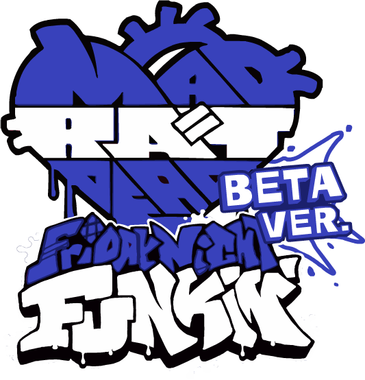

# Friday Night Funkin' x Mad Rat Dead Mod

### This a public beta of a WIP of the FNF x MRD Mod running on [Kade Engine](https://github.com/KadeDev/Kade-Engine).

## What is Kade Engine?
**Kade Engine** is a mod for Friday Night Funkin', including a full engine rework, replays, and more.

Links: **[GameBanana mod page](https://gamebanana.com/gamefiles/16761) ⋅ [play in browser](https://funkin.puyo.xyz) ⋅ [latest stable release](https://github.com/KadeDev/Kade-Engine/releases/latest) ⋅ [latest development build (windows)](https://ci.appveyor.com/project/KadeDev/kade-engine-windows/branch/master/artifacts) ⋅ [latest development build (macOS)](https://ci.appveyor.com/project/KadeDev/kade-engine-macos/branch/master/artifacts) ⋅ [latest development build (linux)](https://ci.appveyor.com/project/KadeDev/kade-engine-linux/branch/master/artifacts)**

**REMEMBER**: This is a **mod**. This is not the vanilla game and should be treated as a **modification**. This is not and probably will never be official, so don't get confused.

## Credits
### Friday Night Funkin'
 - [ninjamuffin99](https://twitter.com/ninja_muffin99) - Programming
 - [PhantomArcade3K](https://twitter.com/phantomarcade3k) and [Evilsk8r](https://twitter.com/evilsk8r) - Art
 - [Kawai Sprite](https://twitter.com/kawaisprite) - Music

This game was made with love to Newgrounds and its community. Extra love to Tom Fulp.
### Kade Engine
- [KadeDeveloper](https://twitter.com/KadeDeveloper) - Maintainer and lead programmer
- [The contributors](https://github.com/KadeDev/Kade-Engine/graphs/contributors)

### FNF x MRD Mod
 - [Katazuki](https://twitter.com/KatazukiFX) - Programming & Charting
 - [NCHProductions](https://www.youtube.com/c/NCHProductions) - Art
 - [Cutila-Mun](https://twitter.com/Florageiist) - Art & SFX
 - [Yamahearted](http://yamahearted.herokuapp.com/) - Music
 - [You can't beat D](https://twitter.com/You_Cant_Beat_D) - Charting